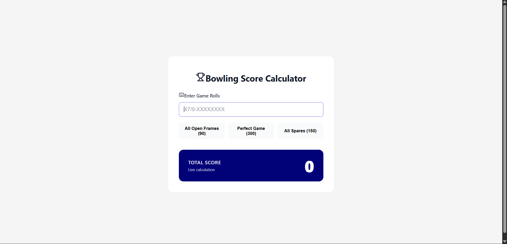

# Bowling Score Calculator (React)

## Overview

This project is a **React-based Bowling Score Calculator** that computes the total score of a single ten-pin bowling game.  
The application calculates the score **live as the user types**, following standard bowling rules, and provides a clean, intuitive user interface.

---

## Problem Statement Summary

A bowling game consists of **10 frames**:

- **Frames 1–9**
  - Up to two rolls per frame
  - Maximum of 10 pins per frame
- **Frame 10**
  - Always at least two rolls
  - One extra roll if the frame is a strike or spare

### Scoring Rules

- **Open frame**: Sum of pins in the frame
- **Spare (`/`)**: `10 + pins from next roll`
- **Strike (`X`)**: `10 + pins from next two rolls`

The final score is the **sum of all 10 frame scores**.

---

## Features

- Live score calculation while typing
- Correct handling of strikes, spares, and open frames
- Special handling for the 10th frame bonus rolls
- Input length restricted to valid bowling limits
- Visual indicator when the game is complete
- Predefined test cases for quick verification
- Clean, professional UI with Lucide icons

---

## Example Inputs

| Input                   | Description     | Score |
| ----------------------- | --------------- | ----- |
| `9-9-9-9-9-9-9-9-9-9-`  | All open frames | 90    |
| `XXXXXXXXXXXX`          | Perfect game    | 300   |
| `5/5/5/5/5/5/5/5/5/5/5` | All spares      | 150   |

These examples are also available as **clickable buttons** in the UI.

---

## Project Structure

```
src/
├── components/
│   └── BowlingScore.jsx
├── utils/
│   └── calculateScore.js
├── App.jsx
├── main.jsx
└── index.css
```

- UI logic is handled in `BowlingScore.jsx`
- Scoring logic is isolated in `calculateScore.js` for clarity and testability

---

## Live Score Calculation Logic

- The input field is implemented as a **controlled React component**
- On every change:
  - The score is recalculated using a pure utility function
  - Partial input is supported without crashes or invalid output
- Once the game is complete, further input is restricted

---

## Technologies Used

- React
- JavaScript (ES6+)
- Lucide React (icons)
- CSS

---

## How to Run the Project

1. Clone the repository:

   ```bash
   git clone <your-repo-url>
   ```

2. Install dependencies:

   ```bash
   npm install
   ```

3. Start the development server:

   ```bash
   npm run dev
   ```

4. Open the application in your browser.

## Screenshots


